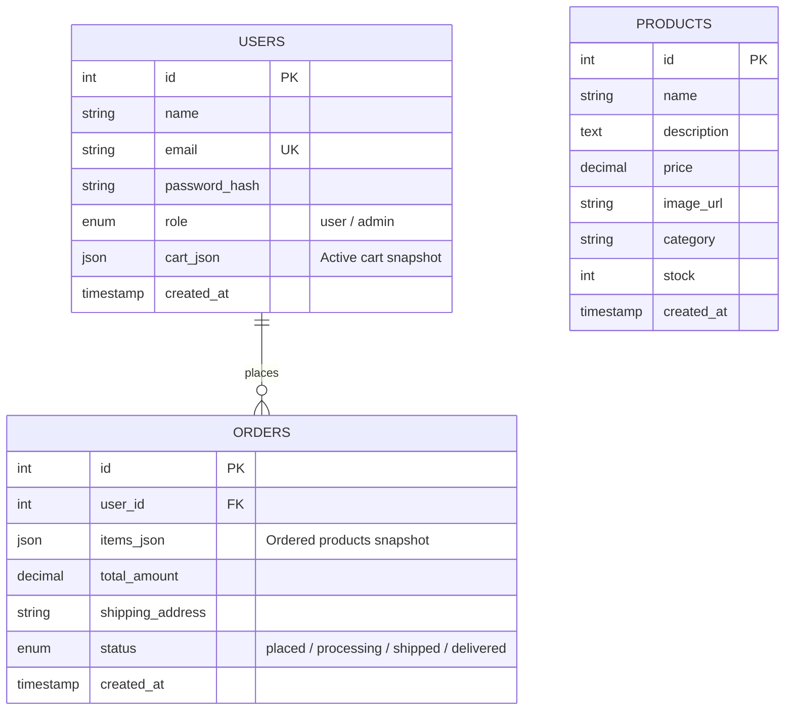

<p align="center">
  
</p>

<h1 align="center">🛒 CodeAlpha E-Commerce Store</h1>

<p align="center">
  <a href="LICENSE"></a>
  <a href="https://nodejs.org/"></a>
  <a href="https://expressjs.com/"></a>
  <a href="https://www.mysql.com/"></a>
  <a href="https://jwt.io/"></a>
</p>

A modern, highly optimized, and production-ready full-stack E-Commerce Web Application. This project is built using a lightweight and clean architecture: Vanilla HTML5, CSS3, and ES6+ JavaScript on the frontend, with a robust Node.js, Express, and MySQL backend.

This store includes full user checkout flows, shopping cart management, persistent order tracking, and a comprehensive administrative dashboard for catalog management.

---

## 🚀 Key Features

### 👤 Customer Experience
* **Secure Authentication:** User sign-up and login powered by JSON Web Tokens (JWT) and Bcrypt hashing.
* **Interactive Catalog:** Fast search, filtering, and detail viewing for store items.
* **Stateful Shopping Cart:** Add, update, and remove products dynamically, backed by persistent database storage.
* **Seamless Checkout:** Fully integrated shipping details submission and checkout process.
* **Order History:** Detailed historical record of all past purchases with itemized receipts.

### 🛡️ Administrative Dashboard
* **Admin Authentication:** Restricted entry points ensuring only authorized users access management features.
* **Catalog Control (CRUD):** Live options to create, read, update, and delete products with image uploading support.
* **Order Oversight:** View all processed store orders, track payment amounts, shipping destination, and fulfillment status.

---

## 🛠️ Tech Stack & Architecture

| Layer | Technologies Used | Description |
| :--- | :--- | :--- |
| **Frontend** | HTML5, CSS3, Vanilla JS (ES6+) | Modern flexbox/grid layout, CSS custom properties, asynchronous REST interactions using `fetch` API. |
| **Backend** | Node.js, Express.js | Modular router structure, customized middleware (auth, database state, error handling, static serving). |
| **Database** | MySQL / MariaDB | Relational storage utilizing connection pooling (`mysql2/promise`) for scaling. |
| **Security** | JSON Web Tokens, Bcrypt | Token-based stateless authentication and secure cryptographic password hashing. |
| **Validation** | Express Validator | Strict backend data validation and sanitization for request payloads. |

---

## 📂 Project Structure

```text
CodeAlpha_EcommerceStore/
├── client/                      # Frontend Application (Served statically)
│   ├── index.html               # Homepage (Product listing)
│   ├── login.html               # Customer login portal
│   ├── register.html            # Customer registration portal
│   ├── products.html            # Search & category browse page
│   ├── product.html             # Detailed product page
│   ├── cart.html                # User cart review & checkout
│   ├── orders.html              # Customer order history dashboard
│   ├── admin.html               # Admin backend catalog & order list
│   ├── css/
│   │   └── styles.css           # Global design system, variables & animations
│   ├── js/
│   │   ├── admin.js             # Admin dynamic interactions
│   │   ├── api.js               # Centralized fetch client (handles JWT headers)
│   │   ├── cart.js              # Cart business logic
│   │   └── ui.js                # Core UI helpers & notifications
│   └── assets/                  # Images and graphics
│
├── server/                      # Backend API Server
│   ├── src/
│   │   ├── config/              # Server configuration and environment setup
│   │   ├── controllers/         # Request handlers (auth, products, cart, orders)
│   │   ├── database/            # Connection pool & database migrations (schema/seed)
│   │   ├── middleware/          # JWT check, db monitor, validation rules, error boundaries
│   │   ├── routes/              # Modular Express routing tree
│   │   └── utils/               # Hash generator and security helpers
│   ├── scripts/                 # Utility scripts (e.g., local database launchers)
│   ├── uploads/                 # Storage for uploaded product images
│   ├── .env.example             # Template for local configurations
│   ├── package.json             # Backend dependencies & run scripts
│   └── server.js                # Application bootloader
└── LICENSE                      # Project License
```

---

## 📊 Database Architecture

The relational schema is configured to be simple yet powerful, utilizing JSON capabilities of MySQL:



### 💡 Notable Design Choices
* **JSON Cart Columns:** Active user carts are stored as dynamic JSON within the `users` table to eliminate excessive join overhead for frequent add/remove operations.
* **Order Item Snapshots:** When an order is placed, full product snapshots (including prices and names at the exact time of order) are captured in `items_json` on the `orders` table. This ensures financial audit trails are preserved even if database products are subsequently modified or deleted.

---

## 🔄 Detailed Workflow (How It Works)

The following sequence describes the end-to-end operational flow when a user interacts with the application:

1. **User Authentication & Session Management**:
   - The user registers or logs in via the client portal.
   - The backend validates the details, hashes passwords using **Bcrypt**, and issues a stateless **JSON Web Token (JWT)**.
   - The client saves this token in local storage and attaches it as an `Authorization: Bearer <token>` header to all subsequent requests via the centralized client [api.js](file:///media/max/New%20Volume/CodeAlpha_EcommerceStore/client/js/api.js).

2. **Browsing Catalog & Fetching Products**:
   - The browser requests product listings from the Express server.
   - The backend retrieves the product records using a MySQL pool connection and returns them in clean JSON format.
   - The frontend's dynamic UI renders the catalogs and filters items on the fly using CSS Flexbox/Grid layouts and vanilla JavaScript modules.

3. **Stateful Shopping Cart Operations**:
   - When a user adds an item to their cart, a request is dispatched to the backend.
   - Instead of managing state solely on the client side or using complex relational join queries, the backend updates a centralized `cart_json` column directly within the `users` table. This provides cross-device persistence with low read-write overhead.

4. **Secure Checkout & Order Placement**:
   - The user submits their shipping address on the checkout screen.
   - The backend server processes the order inside a MySQL transaction:
     - It fetches current prices directly from the database to prevent client-side price manipulation.
     - It verifies if the requested product quantities are available in stock.
     - It serializes a snapshot of the cart's items, prices, and descriptions into a `items_json` column in the `orders` table (preserving audit integrity even if items are modified/deleted later).
     - It decrements product inventory, flushes the user's `cart_json` in the database, and stores the completed order record.

5. **Administrative Controls**:
   - Authorized administrators access a separate dashboard protected by JWT role-based security (`admin` role check).
   - Admins can perform full CRUD operations on products (with file upload middleware managing product images) and monitor order statuses in real-time.

---

## ⚙️ Quick Start Guide

### Prerequisites
* **Node.js** (v18.0.0 or higher recommended)
* **MySQL** or **MariaDB** server

---

### Step 1: Database Initialization
Log in to your SQL instance and run the schema and seed scripts to create the database and default records:

```bash
# Import database structure and setup user tables
mysql -u root -p < server/src/database/schema.sql

# Import seed data (Default products and accounts)
mysql -u root -p ecommerce_store < server/src/database/seed.sql
```

---

### Step 2: Environment Configuration
Copy the sample environment file and adjust configuration values:

```bash
cp server/.env.example server/.env
```

Open `server/.env` and update configuration with your local database access details:
```env
PORT=5000
DB_HOST=127.0.0.1
DB_PORT=3306
DB_USER=root
DB_PASSWORD=your_mysql_password
DB_NAME=ecommerce_store
JWT_SECRET=replace_with_a_long_random_secret
FRONTEND_ORIGIN=http://localhost:5000
```

---

### Step 3: Install & Launch Backend

```bash
# Move into the server folder
cd server

# Install Node modules
npm install

# Run backend development server (includes hot-reloading)
npm run dev
```

*The Express server automatically hosts the static client. You can now open your browser and navigate to **`http://localhost:5000`** to view and test the application.*

---

## 🔑 Demo Credentials

| Role | Email Address | Password |
| :--- | :--- | :--- |
| **Standard User** | `user@demostore.com` | `User@123` |
| **Administrator** | `admin@demostore.com` | `Admin@123` |

---

## 🔌 API Reference Guide

### Authentication
* `POST /api/auth/register` - Registers a new user.
* `POST /api/auth/login` - Logs in user, returns access token.

### Product Management
* `GET /api/products` - Returns a list of all products.
* `GET /api/products/:id` - Returns detailed information for one product.

### Shopping Cart
* `GET /api/cart` - Returns the user's active cart.
* `POST /api/cart/add` - Adds a product / updates product quantity in the cart.
* `DELETE /api/cart/remove/:id` - Removes a specific product from the cart.

### Order System
* `POST /api/orders` - Creates a new order from current cart and clears it.
* `GET /api/orders` - Lists order history for the authenticated user.

### Administrative Controls
* `POST /api/admin/login` - Administrator login.
* `POST /api/admin/products` - Adds a new product (handles image uploads).
* `PUT /api/admin/products/:id` - Updates details of an existing product.
* `DELETE /api/admin/products/:id` - Deletes a product from database.
* `GET /api/admin/orders` - Fetches all customer orders.

---

## 👤 Author & Owner

**Manmath Gonewar**
* 📧 Email: [manmathgonewar@gmail.com](mailto:manmathgonewar@gmail.com)
* 💼 GitHub: [@ManmathGonewar](https://github.com/ManmathGonewar)

---

## ⚖️ License & Academic Usage Disclaimer

This project is licensed under the MIT License - see the [LICENSE](LICENSE) file for details.

### 🎓 Academic & Internship Use
* **Purpose:** Developed as a project showcase for a software development internship at **CodeAlpha**.
* **Educational Use:** Highly recommended for college projects, university submissions, portfolios, or learning Full-Stack JavaScript development (HTML/CSS/JS + Node.js + Express + MySQL).
* **Commercial Disclaimer:** While the MIT License permits commercial reuse and customization, this codebase was built primarily as a demonstration of skills. If you choose to adapt it for commercial businesses or production-grade products, we highly recommend:
  - Performing thorough load testing.
  - Adding API rate-limiting (e.g., using `express-rate-limit`).
  - Employing external secure media storage hosting (e.g., AWS S3 or Cloudinary) rather than hosting file uploads on the local server filesystem.
  - Moving database credentials and JWT secret keys out of code repositories and into secure vault environments.
